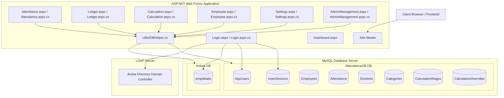

# Attendance & Payroll System: Comprehensive Architecture & Database Documentation

This document provides a complete technical blueprint of the Attendance & Payroll application, detailing its architecture, code structure, database schema, data synchronization flows, and business rules.

---

## 1. System Architecture Diagram

---

## 2. File & Directory Layout

* **`/AttendanceApp.sln`**: The Visual Studio Solution file.
* **`/AttendanceApp.csproj`**: The MSBuild project file outlining assemblies, compilation targets, and file references.
* **`/Web.config`**: Main configuration file containing database connection strings (`CompanyDB` & `AttendanceDB`), application settings (`ADConnectionPath`), Forms Authentication configs, and target framework settings.
* **`/Site.Master` & `/Site.Master.cs`**: The master layout. Handles top and side navigation bars, controls responsive layout styling, and restricts regular users from seeing **Employee Master** and **Calculation** links.
* **`/Login.aspx` & `/Login.aspx.cs`**: Integrates Active Directory authentication with fallback mechanism for admin. Queries `hrdata` for profile metadata, checks roles, and populates session state.
* **`/Dashboard.aspx` & `/Dashboard.aspx.cs`**: The home page displaying stats like active/resigned employee counts and registered system users.
* **`/Employee.aspx` & `/Employee.aspx.cs`**: Employee CRUD portal. Supports bulk CSV imports and automatic division creation.
* **`/Attendance.aspx` & `/Attendance.aspx.cs`**: Central attendance grid interface. Runs core Saturday calculation routines and WebMethods for loading and storing attendance records.
* **`/Ledger.aspx` & `/Ledger.aspx.cs`**: Displays dynamic historical ledger tracking of paid leave balances.
* **`/Calculation.aspx` & `/Calculation.aspx.cs`**: Process category wage rates, overrides, and generates monthly salary worksheets.
* **`/Settings.aspx` & `/Settings.aspx.cs`**: Interface for adding/editing/deleting divisions and skill categories. Cascades modifications to dependent tables.
* **`/AdminManagement.aspx` & `/AdminManagement.aspx.cs`**: Manages application administrators and maps regular users to their permitted divisions.
* **`/Utils/DBHelper.cs`**: Database utility class. Standardizes queries, query retry mechanisms (with exponential backoff), transaction execution, and connection pooling.
* **`/db_setup.sql`**: Database initialization script defining tables, keys, triggers, and mock data.
* **`/DbSetup.cs`**: Command-line utility to run `db_setup.sql` against a target server during installation.

---

## 3. Database Schema Reference

The system utilizes two distinct databases: `hrdata` (to replicate a corporate Active Directory synchronized employee registry) and `AttendanceDB` (the application's transaction database).

### 3.1 Database: `hrdata`

#### Table: `empdetails`
Simulates Active Directory synced user accounts. Used to populate basic profile fields (Name, Designation, and Division) on user login.
* **`PCNO`** (`VARCHAR(50)`, PRIMARY KEY): The Windows Active Directory username or ID.
* **`NAME`** (`VARCHAR(100)`): Employee full name.
* **`DESIGNATION`** (`VARCHAR(100)`): Job title.
* **`DIVNAME`** (`VARCHAR(100)`): The department code string (e.g. `DKRM/ITISG`).

---

### 3.2 Database: `AttendanceDB`

#### Table: `AppUsers`
Authorizes users to log into the web application and assigns system privilege levels.
* **`PCNO`** (`VARCHAR(50)`, PRIMARY KEY): The AD username mapped from `empdetails`.
* **`Name`** (`VARCHAR(100)`): The display name.
* **`Role`** (`INT`, Default: `0`): Access control levels:
  * `1` = System Administrator (full read/write access).
  * `0` = Regular User (restricted read/write access).
  * `2` = Revoked Admin Access (access blocked).
  * `3` = Revoked User Access (access blocked).

#### Table: `UserDivisions`
Maps regular users to the specific division(s) they are permitted to view and record attendance for.
* **`PCNO`** (`VARCHAR(50)`): The user's ID.
* **`DivisionName`** (`VARCHAR(100)`): The name of the division (matches `Divisions.Name`).
* *Primary Key*: `(PCNO, DivisionName)`

#### Table: `Employees`
Stores master profile and contract details for payroll-tracked staff.
* **`ID`** (`VARCHAR(50)`, PRIMARY KEY): Employee contract ID.
* **`Name`** (`VARCHAR(100)`): Full name.
* **`Department`** (`VARCHAR(100)`): Division name.
* **`Category`** (`VARCHAR(50)`): Employee skill classification (e.g., *Skilled*, *Semi-Skilled*, *Unskilled*).
* **`JoinDate`** (`DATE`): Date when the employee was hired.
* **`LeaveBalance`** (`FLOAT`, Default: `0`): Base initial paid leave balance.
* **`Status`** (`VARCHAR(20)`, Default: `'Active'`): Active status (`'Active'` or `'Resigned'`).
* **`ResignDate`** (`DATE`, Nullable): Date when employee resigned.

#### Table: `Attendance`
Transaction table storing historical daily attendance values.
* **`EmpID`** (`VARCHAR(50)`): Link to `Employees.ID`.
* **`Year`** (`INT`): Gregorian calendar year.
* **`Month`** (`INT`): 0-indexed month (January = 0, December = 11).
* **`Day`** (`INT`): Day of the month (1 to 31).
* **`StatusValue`** (`FLOAT`, Nullable): Attendance value:
  * `1` = Present
  * `0.5` = Half-Day
  * `0` = Absent (indicates Unpaid Leave, Paid Leave, or Saturday Cut)
* **`LeaveType`** (`VARCHAR(50)`, Nullable): Paid/unpaid classification:
  * `'Paid'` = Paid Leave (deducts 1.0 from ledger).
  * `'Unpaid'` = Unpaid Leave (does not deduct from ledger).
  * `'Paired Paid'` / `'Paired Unpaid'` = Split leaves.
* **`IsHoliday`** (`BOOLEAN`, Default: `FALSE`): Flags if this day was marked as a company holiday.
* **`AutoSat`** (`BOOLEAN`, Default: `FALSE`): Flags if the entry was automatically calculated by Saturday rule logic.
* *Primary Key*: `(EmpID, Year, Month, Day)`

#### Table: `CalculationWages`
Configures monthly category-wise base wage rates.
* **`Year`** (`INT`), **`Month`** (`INT`): Target period.
* **`Category`** (`VARCHAR(50)`): Skill category name (matches `Categories.Name`).
* **`WageRate`** (`FLOAT`): Per-day wage rate in local currency.
* *Primary Key*: `(Year, Month, Category)`

#### Table: `CalculationOverrides`
Stores manual adjustments to finalized monthly days worked for specific employees.
* **`Year`** (`INT`), **`Month`** (`INT`): Target period.
* **`Category`** (`VARCHAR(50)`): Skill category name.
* **`EmpID`** (`VARCHAR(50)`): Mapped employee.
* **`FinalDays`** (`FLOAT`): Override value for present days.
* *Primary Key*: `(Year, Month, Category, EmpID)`

#### Table: `Divisions`
Master list of permitted corporate departments.
* **`Id`** (`INT`, AUTO_INCREMENT, PRIMARY KEY): ID.
* **`Name`** (`VARCHAR(100)`, UNIQUE): Name of division.

#### Table: `Categories`
Master list of employee categories.
* **`Id`** (`INT`, AUTO_INCREMENT, PRIMARY KEY): ID.
* **`Name`** (`VARCHAR(100)`, UNIQUE): Name of category.

---

## 4. Logical Engine & Business Rules

### 4.1 Exception-Based Attendance Design
The application is designed around an **exception-based logic flow**. By default, if there is no database entry for a given employee and day, the employee is assumed to be **Present (1.0)**. 
Database writes only occur when a day contains a deviation from this default state (e.g., absence, half-day, holiday, or Saturday recalculations).

* **Empty (Default)**: Counted as `1.0` Present.
* **`1`**: Explicitly marked Present (`1.0`).
* **`0`**: Absent. Prompts dropdown selection of **Paid** or **Unpaid** leave.
* **`0.5`**: Half-day. Counted as `0.5` Present.
* **Holiday (`H`)**: Set when `IsHoliday = true`. Automatically sets `StatusValue = null` but retains holiday attributes.

---

### 4.2 Saturday Cut Logic
Saturday attendance is determined dynamically using preceding weekday records:
1. **The Preceding Week Bounds**: When evaluating a Saturday, the engine traces the immediately preceding Monday (5 days back) through Friday (1 day back).
2. **Employment Window Checks**: Any day within the Monday–Friday window that falls before the employee's `JoinDate` or after the `ResignDate` is skipped and is not counted as an absence.
3. **Mid-Week Join Exception**: If an employee's `JoinDate` falls strictly in the middle of a week (after Monday, on/before Friday), the Saturday of that week is automatically set to `0` and marked `AutoSat = true`.
4. **Standard Weekly Check**:
   * If the weekdays contain any Unpaid Leaves (`Val = 0` & `Leave = "Unpaid"`), absences, or if the employee missed a day, the Saturday is forced to `0` and marked `AutoSat = true` (Saturday Cut).
   * Otherwise, the Saturday is automatically set to `1` (Present) and marked `AutoSat = true`.

---

### 4.3 Today-Only Editing Restrictions
To prevent unauthorized historical or predictive changes, regular users (Role = `0`) have editing permissions restricted to the current system date only.

* **Client-Side Restrictions**: On page load, `isToday` is calculated for each day column. If the user is a regular user, all input cells and dropdown elements for dates other than today are rendered as `readonly`/`disabled` with gray background styling.
* **Server-Side Security**: The `SaveData` WebMethod executes a strict session check. If `Session["Role"] != 1`, it loops through incoming changes and ignores any entries where the date does not match `DateTime.Today`.
* **Admin Exemption**: Administrators (Role = `1`) bypass these checks entirely and retain full capability to read/write past, present, and future attendance.

---

### 4.4 Leave Balance Ledger Flow
The Ledger calculates leave balances dynamically, preventing data duplication or synchronization errors:
* **Opening Balance**: Calculated dynamically at runtime by fetching the employee's baseline `OpeningLeaveBalance` (from the `Employees` table) and subtracting all historical **Paid Leaves (1.0)** and **Half-Days (0.5)** taken in all preceding months up to the viewed month.
* **Current Deductions**: Deducts 1.0 day for each current month's **Paid Leave** and 0.5 days for each **Half-Day**.
* **Closing Balance**: `Opening Balance` - `Current Deductions`.
* **Exclusions**: Unpaid leaves and Saturday cuts are tracked for visibility, but do not deduct from the paid leave balances.

---

### 4.5 Payroll Wages Calculations
The payroll engine determines finalized payments dynamically to match client-side visual tallies:
1. **Base Working Days**: Counts all Mondays through Saturdays in the target month that fall within the employee's active contract window (`JoinDate` to `ResignDate`), then adds any Sunday holidays explicitly marked `IsHoliday = 1` in the database.
2. **Absence Deductions**: Sums all weekday absences (Unpaid Leaves), Saturday Cuts, and Half-Days (computed as `Half-Days * 0.5`).
3. **Present Days**: `Base Working Days` - `Absence Deductions` (Paid Leaves are not deducted, meaning employees are paid for them).
4. **Overrides**: If a manual override is registered in `CalculationOverrides` for that month, the system swaps the calculated Present Days with the override value.
5. **Final Wage**: `Present Days` * `WageRate` (retrieved from `CalculationWages` based on Category).

---

## 5. Security & Authentication Flow

1. **Authentication Attempt**: A user enters their username and password on [Login.aspx](file:///e:/attendence/AttendanceApp/Login.aspx).
2. **Active Directory (AD) Check**: The application contacts the Active Directory Server using LDAP (configured via `ADConnectionPath` in `Web.config`). 
3. **Admin Fallback**: If the username is "admin" and the local database indicates they are a System Administrator (Role = `1`), the application skips the AD connection to allow emergency standalone configuration.
4. **AppUser Verification**: If AD authenticates the user, the database is queried for their Role:
   * Role `1` / `0` -> Allowed entry.
   * Role `2` / `3` -> Blocked (revoked access).
5. **Session Initiation**: On successful validation, the system writes user metadata (PCNO, Name, Role, AllowedDivisions, Active Division, and Designation) to `Session`. Forms Authentication generates the auth cookie, redirecting the user to `Dashboard.aspx`.

---

## 6. Offline Implementation Considerations

For the application to operate fully offline on a standalone computer:
1. **Local MySQL Server**: MySQL must be running locally, and connection strings in `Web.config` must point to `127.0.0.1:3306`.
2. **AD Bypass / Local LDAP**: Since Active Directory uses a specific network IP (`192.168.0.106`), running on an isolated network will cause AD authentication to time out. For standalone offline usage, the active directory validation must be bypassed or targeted to a local domain controller instance.
3. **Setup Initialization**: Run `DbSetup.exe` (after verifying the port matches the local MySQL port in `DbSetup.cs`) to generate the required databases and seed initial lookup registers.
